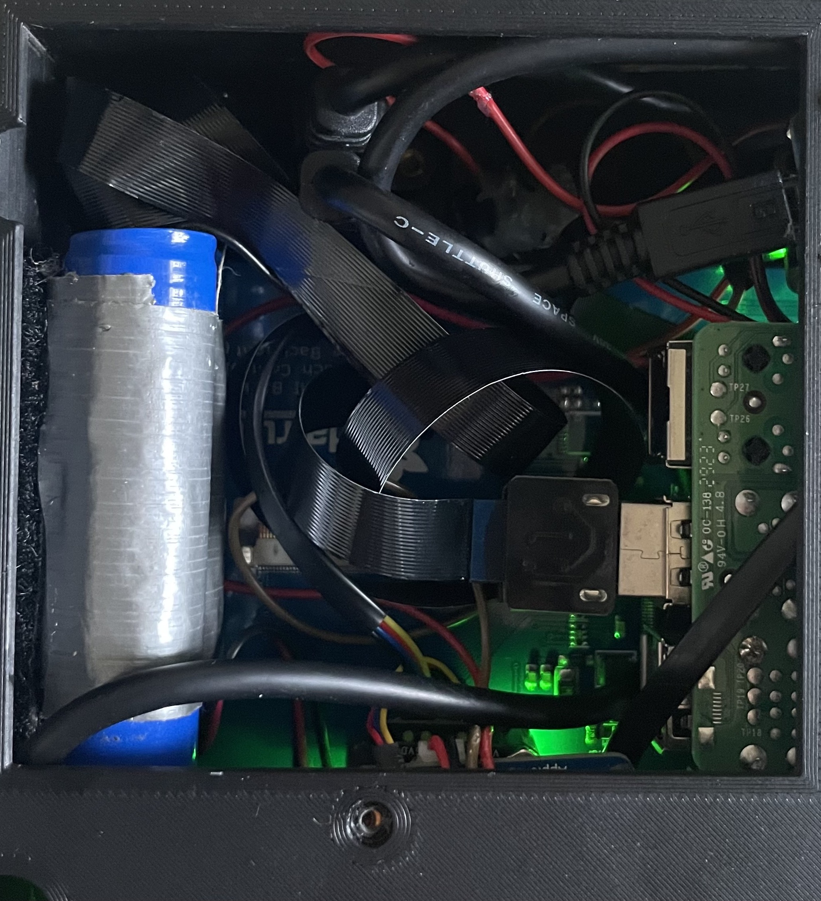
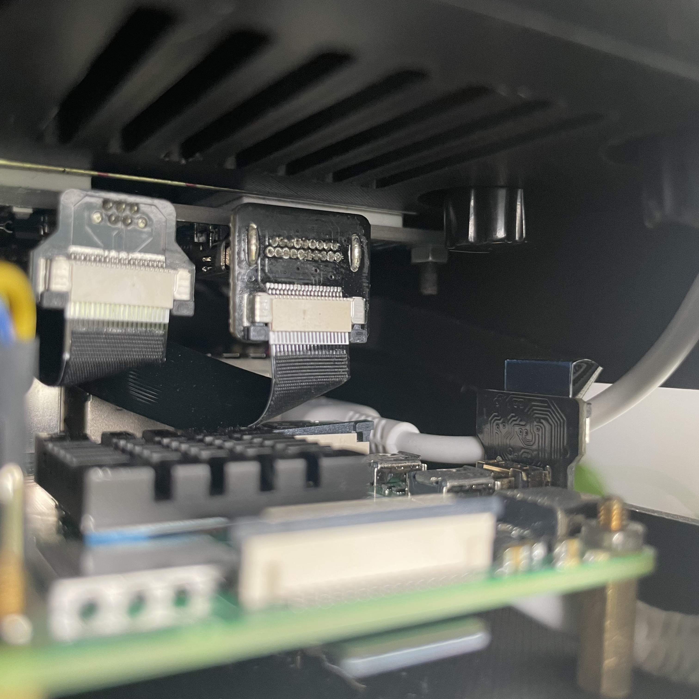
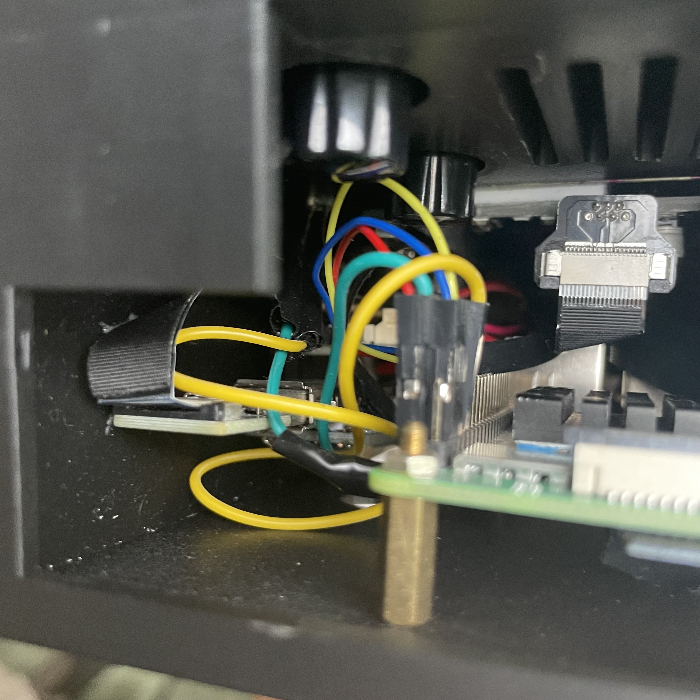
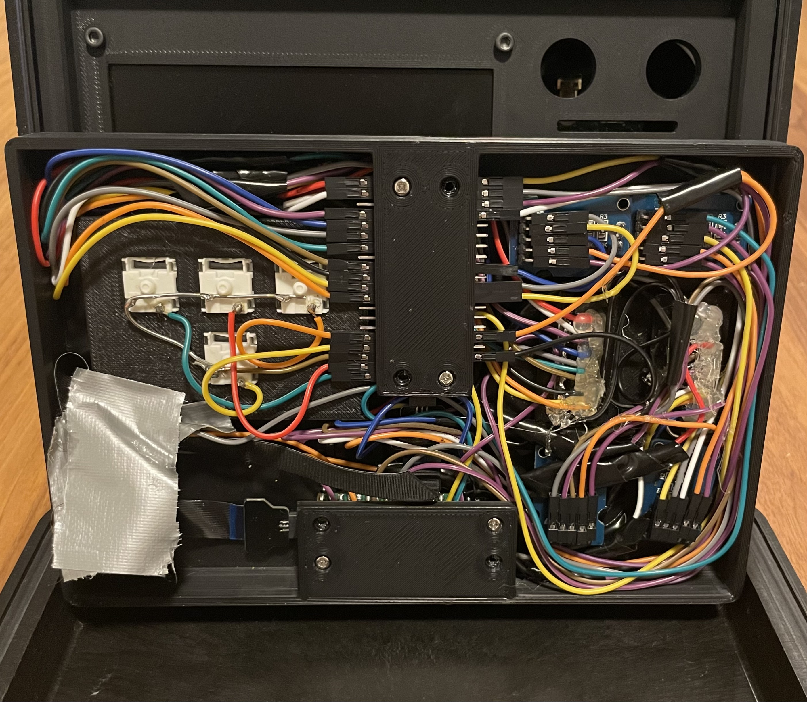
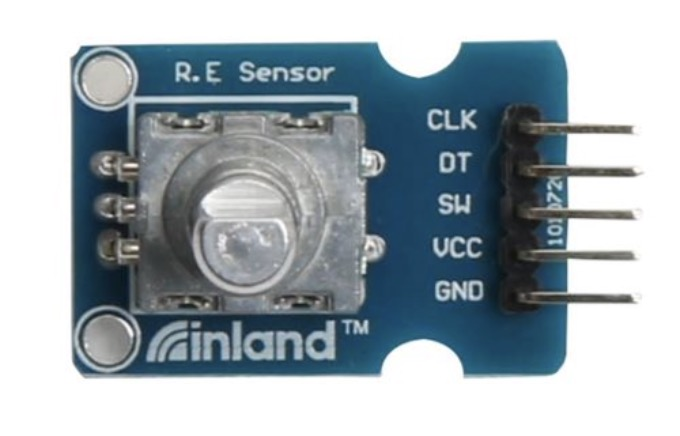
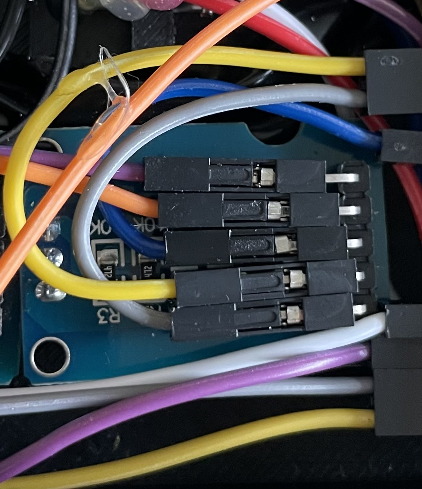
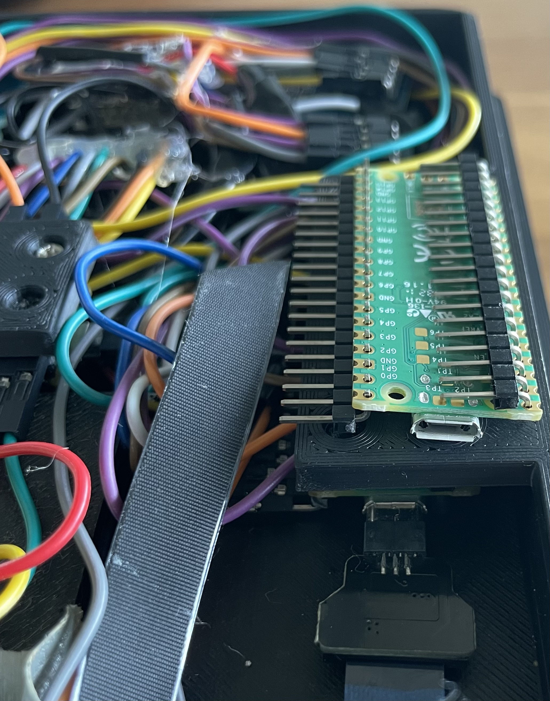
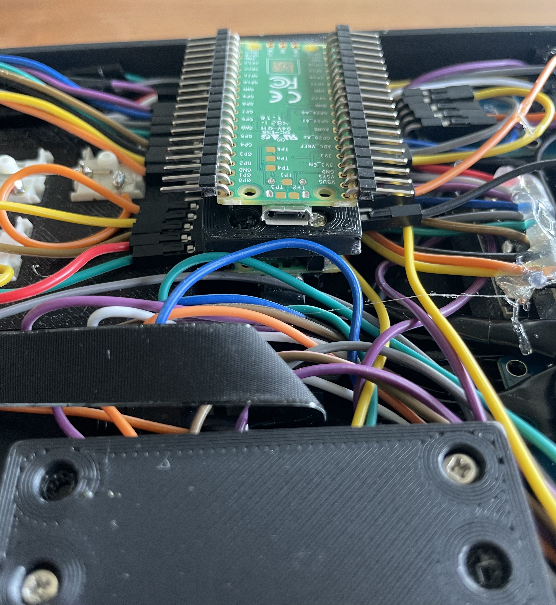
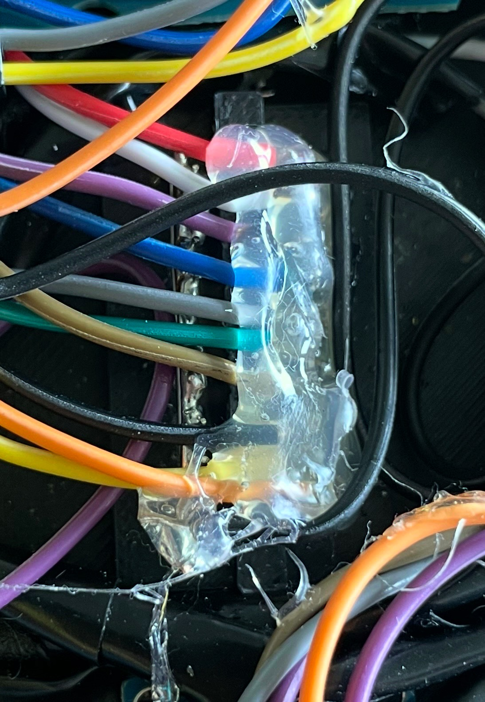

# Mission Control Project (Work in Progress)
<p align="center">

</p>

This Mission Control project is a control interface for a robot controlled via a client web interface served at `http://robot-hostname.local:8000` using WebSockets. The robot hosts a server and the Mission Control, along with being a control interface, broadcasts battery gauge readings for its display and Pi via WebSockets.

🔗 [Robot repo here](https://github.com/clds84/robot_app)

> A regular laptop or desktop can also be used as a client if you don’t want to build Mission Control hardware.

A watch case from the brand Unimatic is used to serve as the housing for this project. It's a more niche setup to use this case versus a Pelican case, but a Unimatic watch case can be purchased online if you don't want to experiment with modifying the .stl file or work on a design from scratch for the Pelican case. However, it could give you the chance to serve your own needs and add your signature.


---

## 📑 Table of Contents

1. [Setup (Overview)](#setup-overview)
2. [Features](#features)
3. [Hardware](#hardware)
4. [3D Printed Parts](#3d-printed-parts)
5. [How to Build](#how-to-build)
6. [System Overview](#system-overview)
7. [How to Use](#how-to-use)
8. [Dependencies](#dependencies)
9. [Service Files](#service-files---copy-in-system-and-user-services)
10. [Powering On for Use](#powering-on-for-use)
11. [Operating robot in a new environment](#operating-robot-in-a-new-environment)
12. [Controls for Laptop or Desktop](#controls-for-laptop-or-desktop)
13. [Code](#code)
14. [Troubleshooting](#troubleshooting)

## Setup (Overview)

This project involves physical hardware, system services, and network setup. Use this section as a high-level checklist to guide your deployment.

1. **Assemble hardware**  
  Install and wire hardware inside 3D printed parts. Refer to [How To Build](#how-to-build) section for guidance if needed.

2. **Flash Raspberry Pi OS and configure WiFi**  
  Flash the SD card with a full OS and set up WiFi.

3. **Clone this repo**
  ```bash
  git clone https://github.com/clds84/mission_control_app
  cd mission_control
  ```
 Set up virtual environment (Optional):
  ``` bash
  python3 -m venv venv (optional)
  source venv/bin/activate (optiona)
  ```
4. **Install dependencies**
   > pip install -r requirements.txt

5. **Copy services and Pico files**

    Copy `battery_status.service` and `start_chromium.service` into `~/.config/systemd/user/` 
    
    Copy Pico folders into Picos that have been flashed with CircuitPython. For information on installing CircuitPython on a Pico, check out the tutorial on Adafruit's website.

    [Setting up Pico](https://learn.adafruit.com/getting-started-with-raspberry-pi-pico-circuitpython/circuitpython?gad_source=1&gad_campaignid=21079267614&gbraid=0AAAAADx9JvRjtoqjIYq9UEM2eLZpWssM2&gclid=Cj0KCQjwmK_CBhCEARIsAMKwcD5siCjgq94ZBptRdrNc88MBBWlfSgQVt83iIU242RNPsfV2uoISjUYaApUQEALw_wcB)

6. **Enable and start services**

    Enable and start user-level services:
    ```bash
    systemctl --user enable battery_status.service start_chromium.service
    systemctl --user start battery_status.service start_chromium.service
    ```

7. **Access the robot interface**

    This will happen as a result of the service, `start_chromium.service`, that runs a Chromium browser and accesses the client web interface at `http://robot-hostname.local:8000`

8. **Operate the robot**

    Us the key switches and rotary encoders as described below in [Interface Controls](#interface-controls) in order to operate the robot.

## Features

- WebSocket-based communication between Mission Control and robot for battery gauge readings served as part of the client web interface
- Robot local web interface accessed via Chromium full-screen mode at boot via user-services.
- WASD key switch format for robot movement
- Two rotary encoders for camera pan and tilt
- Rotary encoder for toggling LED on/off and brightness control
- Rotary encoder for toggling motor speed on/off and speed control


## Hardware

- [Raspberry Pi 4](https://www.adafruit.com/product/4296)
- [2 Raspbery Pi Picos](https://www.adafruit.com/product/4864)
- [Adafruit display backpack](https://www.adafruit.com/product/2406?srsltid=AfmBOoo5Y7nGptT-wOc9AmcbFlIyJ2-hnlTWUWPRzU95_ZBXKhepWs9C)
- [2 LED bar graphs](https://www.adafruit.com/product/1813)
- [Adafruit PowerBoost 1000 charger (for Lithium Polymer (LiPo) battery)](https://www.adafruit.com/product/2465)
- [Adafruit PowerBoost 500 charger](https://www.adafruit.com/product/1944)
- [2 Adafruit battery gauge monitors](https://www.adafruit.com/product/5580)
- [Adafruit I2C multiplexer](https://www.adafruit.com/product/5664)
Two options for rotary encoders. The ones from Micro Center will require more work and will cost more:
  - [4 rotary encoders (DigiKey)](https://www.digikey.com/en/products/detail/bourns-inc/PEC11R-4220F-S0024/4499660?so=86784445&content=productdetail_US&mkt_tok=MDI4LVNYSy01MDcAAAGTA-whzn1JTIybEydRaW0Ep53VlwuvyuYp4rEG7y9rk53ZQs2VFSbKEN7YLI-JwJRd5P2tEPgzXviZYZF7FUnwxo7SUgrKpPcp1EpHl2bD)
  - [4 rotary encoders (Micro Center)](https://www.microcenter.com/product/618904/inland-ks0013-keystudio-rotary-encoder-module)

## Additional parts

- [2 USB-C panel mount cable](https://www.adafruit.com/product/4056)
- [4 key switches](https://www.adafruit.com/product/4952)
- [4 keycaps](https://www.adafruit.com/product/5008)
- [4 rotary encoder knobs](https://www.adafruit.com/product/5541) (these are technically for potentiometers but work)
- [20 220 ohm resistors](https://www.adafruit.com/product/2780) 
- [3 USB-A plugs (Straight)](https://www.adafruit.com/product/4109)
- [HDMI plug (Right Angle - R Bend)](https://www.adafruit.com/product/3549)
- [Micro HDMI plug (Right Angle - R Bend)](https://www.adafruit.com/product/3557)
- [Micro USB plug (Right Angle - Down)](https://www.adafruit.com/product/4105)
- [2 Micro USB plugs (Straight)](https://www.adafruit.com/product/4106)
- [2 50cm ribbon cable](https://www.adafruit.com/product/3563)
- [2 20cm ribbon cable](https://www.adafruit.com/product/3561)
- [QT STEMMA/female Dupont cable](https://www.adafruit.com/product/4397)
- An assortment of QT stemma cables are needed for connecting battery gauges to multiplexer, multiplexer to Pi, and it's better to have some additional lengths that you might prefer to use for cable management:
  - [50mm QT Stemma cable](https://www.adafruit.com/product/4399)
  - [100mm QT Stemma cable](https://www.adafruit.com/product/4210)
  - [200mm QT Stemma cable](https://www.adafruit.com/product/4401)
  - [300mm QT Stemma cable](https://www.adafruit.com/product/5384)
- [switch]()
- [LED](https://www.adafruit.com/product/300)
- [Jumper wires](https://www.adafruit.com/product/266)
- [~10mm standoffs](https://www.amazon.com/Csdtylh-Male-Female-Standoff-Stainless-Assortment/dp/B06Y5TJXY1/ref=sr_1_3?crid=1C5C5DJQV4P9T&dib=eyJ2IjoiMSJ9.kLaf3K2RMBAjDWJZChyEdO_Dhhv3WHgJIByaTMswudJYop1O0EzcnZKcc1WrFWzQPL7qJaUKBiCUbQF0h1FxML1H-vl406pZ9OYwO-H19wcPL-sgn3ltMA0yoItwFSzXWt7hTWNkDDn4uLRtgt4w9H8YyblRCVxWNg1ytOBmTmprqt59Jg12xmjQ3cz1r740Aqwi1nJXQrq5zZr0nlRBnbn5tmiSq_FlQ4hmgpOCBVA.NDt05H8B5A_WVc3SC-LsNdHSNOq73NPhoAKYuXIvo_s&dib_tag=se&keywords=standoff%2Bkit&qid=1750179668&sprefix=standoff%2Bkit%2Caps%2C100&sr=8-3&th=1)
- [18 gauge solid wire](https://www.amazon.com/dp/B085QD9DWP?ref_=ppx_hzsearch_conn_dt_b_fed_asin_title_7&th=1)
- [wire wrap tool](https://www.amazon.com/dp/B00BFYE0CY?ref_=ppx_hzsearch_conn_dt_b_fed_asin_title_6)
- 8 ~12mm M3 socket cap bolts (local hardware stores sell these)
- long reach toolkit for fastening nuts to display socket cap bolts

### Watch Cases:

- [Unimatic](https://www.unimaticwatches.com/utcase/?utm_source=google&utm_medium=paid&utm_campaign=19482995497&utm_content=&utm_term=&gadid=&gad_source=1&gad_campaignid=19482687050&gbraid=0AAAAADFBVhVcNUgAm4EVyVVlri3Z6knEH&gclid=Cj0KCQjwmK_CBhCEARIsAMKwcD50w9FguGeLGCXvBZO0s7XWOidrKqhi3FIC263coEC9vBCH0YQL2A4aAp1rEALw_wcB) (inner dimensions: 7.48 x 5.12 x 3.54 in) 
- [Pelican 1120](https://www.pelican.com/us/en/product/cases/protector/1120/) (Inner dimensions: 7.29 x 4.78 x 3.33 in)

The Pelican is cheaper and the only drawback is having to design the .stl files but it can serve as a learning experience. The Unimatic case was laying around and was the inspiration so it was used.

## 3D Printed Parts

Included `.stl` files for:

- Large compartment
- Small compartment 

The large compartment 3D print that houses the Pi, the display, and other hardware does not initially fit well because the case's internal dimensions aren't symmetrical, so some sanding with a dremel was used in order to get the fit just right which is not too snug and not too lose. This allows sliding it in and out with slight effort in order to access the hardware if needed. This is especially useful when troubleshooting for an extended period of time where a power connection from an outlet is preferrable to not drain the LiPo. Sanding was preferred over repeated print testing because of insufficient access to a 3D printer for additional versions.


It's recommended to print a small sliced segment for the back and face of the parts for testing fitment before printing the entire part. 

>**Disclaimer: The .stl pieces were glued together and everything has worked great, but this poses an issue for removing the display in case it fails. It might be sufficient to snap the two halves that make up the large compartment but there is the possbility of them separating while pulling the compartment out from the case. If you want to avoid running into this or any other issues, it's recommended to use design software to include two half-moon designs with a threaded hole on an accessible part of the inside of both large compartment pieces in order to clamp them together.**

## How to Build 

**Tips:**

- It's recommended to **breadboard or loosely wire** all components first to test functionality before permanent mounting. See [How to Use](#how-to-use) to make sure hardware is installed properly and the software behaves as expected.
- You may need a **conical file** to widen mounting holes on the battery gauges or multiplexer to fit standoffs.
- **Power stacking**: The PowerBoost, battery gauges, and multiplexer stack cleanly using standoffs.

---

### Large Compartment - Display

Use the M3 socket cap bolts and nuts to fasten the display to the large compartment.

### Large Compartment - Pi

Install the raspberry Pi with ~10mm standoffs. 

### Large Compartment - LiPos

Tape lipos together with wiring on opposite ends and velcro apply a rectangular piece of heavy duty velcro tape with as much surface area as possible. It will be installed later and you can see where in the images below.

### Large Comparmtent - Switches, LED, Panel Mounts

  - Jumper wires
    - Solder two jumper wires to each button switch and make sure they have female Dupont connectors on the other end. 
  - LED
    - solder two wires to the LED and make sure they have female Dupont connectors on the other end.
  - Panel Mounts
    - Install panel mounts with 3M socket cap bolts

### Large Compartment - PowerBoosts


There are two different types of PowerBoosts in order for the JST connectors to face the midline and the USB-A to face the side opening. The PowerBoost closest to the ethernet port is the 1000 while the other is the 500. Depending on which PowerBoost/hardware combo you want, you can swap their position now or swap cable connections to the PowerBoost USB ports when following the continued instructions below.

> Solder right angle headers to the EN and GND header pin holes on bottom of both powerboosts, pointing toward the midline. The jumper wires that connect to these pins are from the switches (one PowerBoost to one switch). These control current from the LiPo to the hardware and will turn on the devices when you press the switches. 

### Large Compartment - PowerBoost/Battery Guage/Multiplexer stack and more


This image shows how the stacks are setup as well as the wiring start and endpoints. The QT stemma cable for the multiplexer to the Pi is a QT stemma connector on one end for the multiplexer and Dupont connectors on the other end for the Pi.

> The display and Pi have separate power sources.

The image shows the PowerBoost 1000 used for the display power, but you can designate them for the opposite case. It's just a suggestion and can depend on your lipo setups. The 1000 will charge at a faster rate, 1000mA vs 500mA.

> Refer to the images below for plugs and ribbons used for the Pi, display, and PowerBoost ports. 

### Large Compartment - Bottom View


This show shows the LiPos, one LiPo per hardware (Pi and display), taped and velcroed to the inner side of the large compartment.

Also shown are two USB-A plugs (straight) for the Picos, and the USB-C panel mounts that connect to the PowerBoosts. The other PowerBoost sits in the lower part of the image. There's a hole without a screw there for the standoff because it's preferrable to use one standoff and let the PowerBoost shift if needed so avoid putting stress on cables. You can see this in the PowerBoost in the top of the image where the panel mount's micro USB plug is at an angle.

### Large Compartment - Side View 


From the side opening, you can see the micro HDMI plug (R bend) for the Pi on the right,  and the HDMI plug (Right Angle - R Bend) for the display. Use the 25cm ribbons for these plugs that connect the display to the Pi. The micro USB plug (Right Angle - Down), the dipay's power source, is the middle plug in the picture and its other end will connect to the PowerBoost 1000 in the next image.

The white cable is a USB-A plugging into the PowerBoost 500's USB-A port and its other end, a USB-C, that plugs into the Pi's power port. This is disconnected in the image because of troubleshooting that was done with a power source coming from a wall outlet. There's no reason to troubleshoot with the LiPo as a power source.

### Large Compartment - Side View (continued) 


A USB-A plug (straight) is used for the PowerBoost 1000's USB port because of the clearance to the side of the compartment.In my setup, this plug is the other end of the micro USB plug used for the display.

There are a total of 7 jumper wires connected to the Pi's pinout:
  - Four of the jumper wires are thinner and come from the QT STemma cable from the multiplexer and are the following:
    - The red wire connects to pin 2
    - The black wire connects to pin 6
    - the blue wire connects to pin 3
    - The yellow wire connects to pin 5
  - Two of the jumper wires that are thicker are for the LED next to the power switch;
    - The green wire connects to pin 4
    - The yellow wire connects to pin 9

---
### Small Compartment 


A few things to note about the small compartment:

> Perhaps the most important point to make is that the pins defined in the code point to how the wiring is setup here and it doesn't need to be followed to a tee. In hindsight, it would have been preferrable to have camera pan and tilt (two encoders) on one pico, and both motor speed/LED control for the robot on the other pico. You can make a choice how you'd prefer to wire it up, but take note of this for defining pins in your code.

- The small compartment is a tight fit for everything, but it works. As mentioned earlier, it's important to make sure everything works so you're not dealing with possibly having to reflash the Pico for whatever reason. It's possible, but you have to use an allen key or something similar in order to reach for the boot sel button. 

- Since there are only 4 key switches, each switch is connected to a pin, as opposed to any matrix setups typically used in QMK or KMK firmware for building keyboards. There is an 18 gauge solid wire connecting all ground, with one jumper wire connecting to the Pico. Each keyswitch has a power wire connected to a pin, as mentioned. This solid wire is also used in the [LED bar graph](#small-compartment---led-bar-graph) below.

- I provided two different rotary encoder options in the parts list. If using the Inland brand from Micro Center, note in the photo below that the header orientation is different from the Mission Control project. For this project, the headers should be removed from the Inland rotary encoder, and new ones should be soldered on their bottom side and facing the midline. This is a tedious process so it would be best to purchase the other option of rotary encoders from DigiKey. 





-The LED bar graphs correspond to the motor speed control and LED toggle/brightness (robot's LEDs). The rotary encoder for LED toggle/brightness serves three key events that are listened for in the browser in order to toggle the LED on/off and control its brightness. 

### Small Compartment - Picos

The two following images show the way the Picos under the black 3D printed sections are installed including header orientation. From the materials list, two of the micro USB plugs are used here. The ribbons connect to the [straight USB-A plugs](#large-compartment---bottom-view) that connect to the Pi's USB-A ports in the large compartment.





### Small Compartment - LED Bar Graph


The right side that is glued includes the 220 ohm resistors per pin. I use the [wire wrap tool]() from the parts list in order to prepare these for soldering. The left side includes an 18 gauge solid wire used to solder all ground together. 

## System Overview

```text
[Mission Control Pi] --> [WebSocket] --> [Robot Pi]
       |                                     |
[Encoders + Keys]                    [Motors, Servos]
[Battery Gauges]                     [Camera + Stream]
                                     [NeoPixels, Battery Gauges]

--------------------------OR------------------------------------

[generic client] --> [WebSocket] --> [Robot Pi]
       |                                     |
    [Keys]                           [Motors, Servos]
                                     [Camera + Stream]
                                     [NeoPixels, Battery Gauges]
```

## How to Use

> Mission Control should be flashed with a full OS and a mobile hotspot shoudl be used for WiFi in order to facilitate SSH sessions for seting up the primary WiFi in that environment. Without an SSH session or a wired connection in a new environment to use Mission Control and the robot, there's no way to access the Pi's Network Manager in the shell in order to create a new WiFi connection. 

### (Optional) Use a Virtual Environment

To avoid polluting your system Python, use the following in robot_app/:

```bash
cd mission_control
python3 -m venv venv
source venv/bin/activate
```

### Dependencies
Install dependencies with:

> pip install -r requirements.txt

### Service Files - copy in user services

Copy `battery_status.service` and `start_chromium.service` into `~/.config/systemd/user/` 

> Run `update_service.sh` to keep the service files in the repo up to date with their copies in the user service directory. This only matters if you plan to change the service files and want the copies in the repo to reflect changes in the user service directory.

- Once the above steps have been completed, the robot Pi automatically runs `battery_status.py` and `start_chromium.service` at boot that opens chromium at full-screen to access the robot's client web interface at `http://robot-hostname.local:8000`. 

### Operating robot in a new environment

- Setup WiFi - this is easily done in the GUI, but if you'd like to practice setting up WiFi in the shell, please continue below:
  - Make use of WiFi script that includes `nmcli` commands. 
  - Once the WiFi script has been used, adjust WiFi priority value with `nmcli connection modify <connection_name> connection.autoconnect-priority: <number>` 
  
  > **Note:** a higher value means higher priority. This will avoid hiccups if the hotspot is still on and has a higher priority than the new WiFi connection. 

After WiFi setup on Mission Control and the robot, the robot's client web interface will be accessed at `http://robot-hostname.local:8000`. If the WiFi was setup in the GUI or through an SSH session, you can use `pkill chromium` to kill the browser and it will reopen in full screen mode because start_chromium.service will run if there's no instance of the browser running, which is `True` once you run pkill chromium. 

> **Note:** The User Interface (UI) is designed primarily for Mission Control's 7" display, so it might feel light on a laptop or desktop. There is room for improving those use cases if preferred over Mission Control, including browser click events as an alternative to key down/up events. 

### Interface Controls

> **Note:** Please refer to the [robot repo](https://github.com/clds84/robot_app) for keyboard controls for a laptop or desktop.

- **Encoder 1 (Motor Speed)** – Toggle motor speed on/off and adjust speed
- **Encoder 2 (LED)** – Toggle LED on/off and adjust brightness
- **Encoder 3 (Camera Pan)** – Tilt camera up/down, reset camera to center position
- **Encoder 4 (Camera Tilt)** – Pan camera left/right, reset camera to center position

- <kbd>W</kbd> – Move robot forward
- <kbd>A</kbd> – Turn robot left
- <kbd>S</kbd> – Move robot in reverse
- <kbd>D</kbd> – Turn robot right

---
### Code

- The Logic for the interface controls is in each pico folder's `main.py`, ex: `/mission_control/picos/pico1/main.py` 
> pico 1 includes and pico 2 includes
- The sensor readings from Mission Control’s battery gauges that are sent to the robot in real-time via WebSockets can be found in `battery_status.py`
- For LED and motor speed, there is encoder state managing logic located in `battery_status.py` passed from Pico > Mission Control > to robot. This is done in order to keep Mission Control's LED bar graph on/off state sychronized with the robot's NeoPixel on/off state. Without it, turning on the robot's NeoPixel prior to turning on Mission Control's LED bar graph would result in a desynchronized situation when pressing the LED bar graph encoder (on), resulting in the NeoPixel turning off. The state managing logic allows them to synchronize.

- For debugging or to check events in realtime, use battery_status.log that will be created in `mission_control/logs/` when services run. Make sure to uncomment lines such as: `logger.info('Current motor speeds: %s, %s', motor3Speed, motor4Speed)` in order to log output.

### Troubleshooting

---

